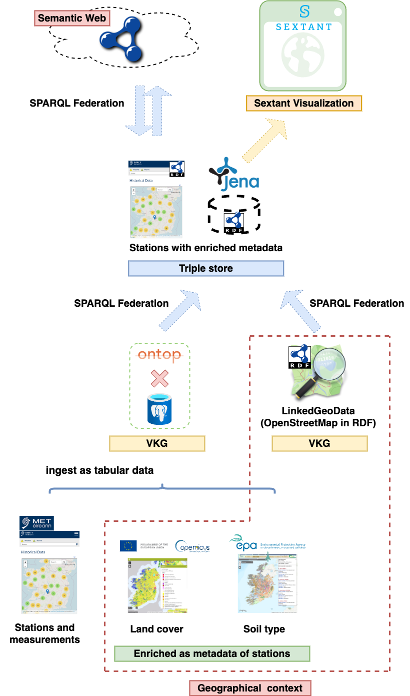

# LinkedGeoClimate

With the spirit of reproducible research, this repository includes a complete collection of codes required to generate the results and diagrams presented in the paper:
    
> J. Wu, F. Orlandi, D. O'Sullivan, S. Dev, LinkedGeoClimate: An Interoperable Platform for Climate Data Access within Geographical Context, *under review*.
    
Please cite the above paper if you intent to use whole/part of the code. This code is only for academic and research purposes.

## Architecture of LinkedGeoClimate:

## How to use
1. [`kgs/`](kgs/) contains component softwares and middles, and also the instructions on the reproduction of LinkedGeoClimate in the paper.
2. [`sparql-queries/`](sparql-queries/) store the results presented in the paper.
